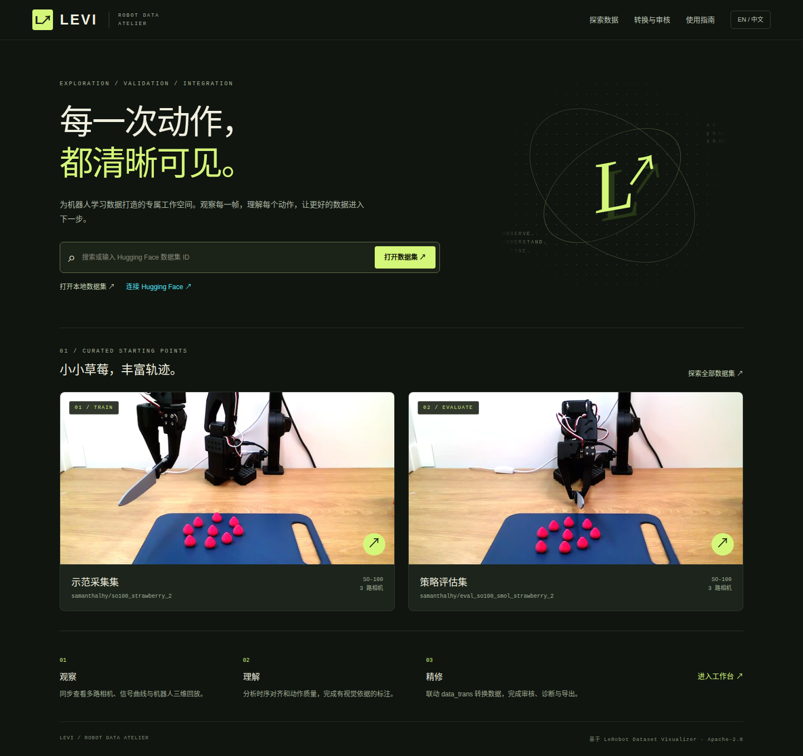

# LEVI · Robot Data Atelier

**LeRobot Exploration, Validation & Integration**

[](https://github.com/Koooki3/LEVI/actions/workflows/test.yml) [](LICENSE) [](CHANGELOG.md)

[中文](README.md) · [Conversion guide](docs/CONVERSION.md) · [Features](docs/FEATURES.md) · [API](docs/API.md) · [Validation](docs/VALIDATION.md) · [Attribution](docs/UPSTREAM.md) · [Third-party notices](THIRD_PARTY_NOTICES.md) · [SAM3 object annotation](docs/SAM3.md)

LEVI is an independent robotics dataset browser, annotation editor, converter and review workbench derived from [LeRobot Dataset Visualizer](https://github.com/huggingface/lerobot-dataset-visualizer). Chinese is the default; English is available through the language switch. **The complete capture conversion pipeline is bundled** and requires no sibling repository or training environment.



Demo footage: the two `samanthalhy` datasets linked below, whose cards declare Apache-2.0. LEVI uses an original graphite, parchment and lime interface.

## Install and run

Install [uv](https://docs.astral.sh/uv/getting-started/installation/) and `ffmpeg`/`ffprobe`. From your cloned repository, whose name and location are unrestricted:

```bash
git clone https://github.com/Koooki3/LEVI.git
cd LEVI
export LEVI_WORKSPACE="$PWD/.state"
cp .env.example .env
export UV_CACHE_DIR="$LEVI_WORKSPACE/.cache/uv"
export UV_PYTHON_INSTALL_DIR="$PWD/.runtime/python"
uv sync --locked
uv run levi setup
uv run levi build
uv run levi serve
```

`uv run levi` is equivalent to `uv run levi serve` and starts both services. Wait for **Ready**, then open **http://127.0.0.1:7860**. Ctrl+C stops both services. Setup installs checksum-verified Bun 1.3.10 in `.runtime/` and locked frontend dependencies. Python dependencies, including the converter, live in `.venv/` and `uv.lock`.

Linux x86_64 is tested. The installer also selects Linux/macOS ARM64 and macOS x86_64 binaries; use WSL2 for Windows. Install FFmpeg through your OS package manager, e.g. `sudo apt install ffmpeg` or `brew install ffmpeg`.

```bash
uv run levi dev
uv run levi serve --port 7870 --backend-port 7871
uv run levi convert --help
uv run levi clean             # preview regenerable caches
uv run levi clean --apply     # remove the listed caches
```

For a remote server, keep `ssh -L 7860:127.0.0.1:7860 USER@SERVER` running on your computer. The frontend defaults to loopback port **7860 (Web UI)** and proxies requests to **7861 (internal API)**. Forward local 7860 to server 7860, not server 7861. If you see `{"detail":"Not Found"}` or the API landing page, check the destination port. The API root now explains the distinction and links to the configured Web UI. `uv run levi backend` starts only the API. The launcher checks port conflicts and announces Ready only after both services respond.

## SAM3 first-deployment sequence

Run these commands from the cloned LEVI root. The checkout name and workspace path are unrestricted:

~~~bash
# 1) Select a workspace and install the core
export LEVI_WORKSPACE="$PWD/.state"
cp .env.example .env
uv sync --locked
uv run levi setup

# 2) Sign in to an account that can read 1038lab/sam3
hf auth login
hf auth whoami
# Without a global hf command:
# uvx hf auth login
# uvx hf auth whoami

# 3) Install the isolated worker on the CUDA host
uv venv --python 3.12 integrations/sam3/.venv
uv sync --project integrations/sam3
export LEVI_SAM3_WORKER_PYTHON="$PWD/integrations/sam3/.venv/bin/python"
export LEVI_SAM3_ENABLED=1

# 4) Run model-free configuration checks
uv run --project integrations/sam3 levi-sam3-worker --check
uv run levi sam3 check

# 5) Build and start the web workbench
uv run levi build
uv run levi serve
~~~

After Ready appears, open http://127.0.0.1:7860. On any dataset annotation page, complete the Hub access, CUDA worker and checkpoint gates, then choose prompts, scope and cameras before clicking Run SAM3 annotation. LEVI validates the model-neutral plan before starting the worker. The first job downloads sam3.pt to $LEVI_WORKSPACE/checkpoints/sam3 and reports progress; later jobs reuse it. Changing the Hugging Face account or workspace creates separate Hub snapshots and sidecars using account and workspace scopes. Set LEVI_SAM3_ENABLED=0 only when you want to hide the real worker. Never commit tokens, checkpoints or workspace data.

## Portable workspace

`LEVI_WORKSPACE` is the data workspace, separate from the Git checkout if desired. It defaults to `.state/` inside the repository. Relative values resolve against the startup directory. Set it in your shell or untracked `.env` (see `.env.example`). No machine-specific parent marker or unrelated project variable is consulted.

| Item | Location |
| --- | --- |
| Code, lockfiles | Git checkout |
| Python, Bun, frontend dependencies | Checkout `.venv/`, `.runtime/`, `node_modules/` |
| Catalog, annotations, reviews, jobs, reports | Workspace `outputs/LEVI/workbench/` |
| Converted datasets | Workspace `datasets/levi_<timestamp>_<id>/` |
| Annotation exports | Workspace `outputs/LEVI/exports/` |
| Downloads/runtime caches | Workspace `.cache/` and `tmp/` |

Place captures under the workspace, or point the workspace to their common parent. Local registration and conversion enforce the resolved path boundary. Conversion rejects symlink inputs and existing output directories. Migration from older LEVI installations requires explicitly setting the previous data workspace in `.env`; data is not moved. Recreate old external conversion plans.

## Features

- Hub search, pagination, public/private access and local dataset registration.
- Synchronized multi-camera playback, timeline, shortcuts, fullscreen, visibility controls and state/action charts; multi-task datasets can filter the episode list by task.
- Language timelines: persistent task augmentation/subtask/plan/memory; speech/interjection/VQA; SAM3 object/track sidecars; bounding boxes and points on video, count/attribute/spatial answers.
- Statistics and episode lengths; movement/smoothness/length filtering; first/last camera frames and per-dataset review flags.
- Action autocorrelation/chunk suggestions, state-action alignment, demonstrator speed and cross-episode variance, scoped to the full dataset, an episode range or a single task, with an optional full-coverage (unsampled) pass.
- Upstream-supported 3D robot playback, joint mapping and end-effector trails.
- Native Doctor with optional sampled video checks and JSON reports; external original Doctor link.
- Built-in conversion stages and full pipeline, editable options, immutable plans, job logs/exit codes, structured results and automatic dataset registration.

Video-based LeRobot v2.0/v2.1/v3.0/v3.1 can be browsed. Embedded-image Parquet playback retains the upstream limitation. Original dataset text and feature/joint identifiers remain unchanged.

### SAM3 object annotation (global)

The annotation tab provides the same SAM3 object/track sidecar for built-in demos, Hub datasets and registered local datasets. The UI checks Hub access, the CUDA worker and the checkpoint first, then builds and validates a plan across an episode range, task selection or the full dataset and selected cameras. Each episode/camera pair is processed independently; model suggestions are stored as lossless RLE sidecar data and native LeRobot files stay read-only. The page shows the current Hugging Face account, worker state, checkpoint download progress and workspace path, and exposes track-level frame ranges with accept/reject review. The default model is sam3.pt from 1038lab/sam3. Real jobs need the isolated Python 3.12 uv worker on a CUDA host; core CPU checks never import Torch, probe CUDA, download a model or run inference. See the SAM3 guide for the complete sequence.

Default live demonstrations:

- [samanthalhy/so100_strawberry_2](https://huggingface.co/datasets/samanthalhy/so100_strawberry_2)
- [samanthalhy/eval_so100_smol_strawberry_2](https://huggingface.co/datasets/samanthalhy/eval_so100_smol_strawberry_2)

The evaluation collection has 10 episodes, 32,033 frames, 30 FPS and three 640×480 cameras. Videos are streamed, not bundled.

## Built-in conversion

Select a capture directory and Full pipeline in Conversion & review, preview the plan, then run it. The pipeline prepares an independent copy, handles images/FPS as needed, checks quality, filters static frames, writes **LeRobot v2.1**, fully decodes output videos for validation, then registers the dataset.

```bash
uv run levi convert pipeline \
  --source captures/session-a \
  --output datasets/session-a-reviewed \
  --fps 10 --source-fps 30
```

Paths are relative to `LEVI_WORKSPACE` or absolute within it. Advanced JSON config includes camera/task maps, excluded capture paths, rotation representation, action mode and quality thresholds. See the bilingual [conversion guide](docs/CONVERSION.md) for schemas, all stages, formulas, source provenance and exit codes.

Default state is absolute XYZ in metres, continuous Euler rotation in radians and binary gripper command (open=1, close=0). Quaternion rotation is optional. Default action is the next state, with the final state repeated. Gripper command is not measured aperture; these semantics must match your policy.

The viewer's Doctor samples video frames. The pipeline's `validate` stage fully decodes local videos and checks schema/alignment. Neither promises compatibility with every training framework.

## Save, export and review

Saving an episode writes a workspace annotation sidecar without changing source files. Offline edits remain in browser session storage until the backend is restored and saved. Dataset export saves current edits first, then writes language columns into a new dataset, preserving its container version.

Annotation export uses video hardlinks where possible; use API `copy_videos=true` for independent copies. Built-in conversion outputs use independent files. Review manifests contain dataset IDs, excluded episode IDs and notes; converted `meta/levi_provenance.jsonl` maps episodes to capture paths. Review that mapping before configuring `exclude_demos`. Flags never delete source data.

Hub upload is an explicit API action requiring a target repository and token; normal conversion and saving do not upload. See [API](docs/API.md).

## Accounts and deployment

Token sign-in validates with HF, stores the token in browser local storage and a video-proxy HttpOnly cookie, and clears both on sign-out. OAuth and backend `HF_TOKEN` are also supported. Never commit credentials or `.env`. Use `LEVI_SECURE_COOKIES=1` for HTTPS/Space iframe deployments.

This is a single-user local workbench with file access. HF sign-in controls Hub access, not LEVI user permissions. Put shared deployments behind an authenticated reverse proxy.

```bash
docker build -t levi:local .
docker run --rm -p 127.0.0.1:7860:7860 \
  -v "$HOME/levi-data:/workspace" levi:local
```

The container includes the converter, Python environment and FFmpeg. No additional code repository is mounted.

## Develop and publish

```bash
# Keep the workspace/cache variables from installation
uv sync --locked --group dev
uv run levi check
mkdir -p "$LEVI_WORKSPACE/tmp/build"
uv run pytest --basetemp="$LEVI_WORKSPACE/tmp/build/pytest"
uv run levi build
# Optional: start the service, then run live checks
PLAYWRIGHT_BROWSERS_PATH="$LEVI_WORKSPACE/.cache/playwright" uv run playwright install chromium
uv run python scripts/verify_browser.py
uv run python scripts/verify_conversion.py
```

Before publishing, preview `uv run levi clean`, then apply with `--apply`. It removes LEVI's regenerable caches and preserves datasets, annotations, review/job reports, `.env`, dependencies and production output. Avoid `git clean -xfd` against a data workspace.

Repository: [Koooki3/LEVI](https://github.com/Koooki3/LEVI). Report reproducible problems and suggestions in [Issues](https://github.com/Koooki3/LEVI/issues). Read [CONTRIBUTING](CONTRIBUTING.md) before submitting changes and [RELEASING](docs/RELEASING.md) for the maintainer release procedure.

Preserve Apache-2.0 `LICENSE`, `NOTICE` and [attribution](docs/UPSTREAM.md). CI runs type/format checks, frontend tests, built-in conversion tests and a production build. See the [validation record](docs/VALIDATION.md) for tested scope and limitations.

If a conversion fails, inspect its structured report and logs. Duplicate/missing frame IDs, unknown gripper commands or video count mismatches stop processing. Interrupted jobs are marked on restart, and partial outputs remain available for review; a retry uses a new directory.
