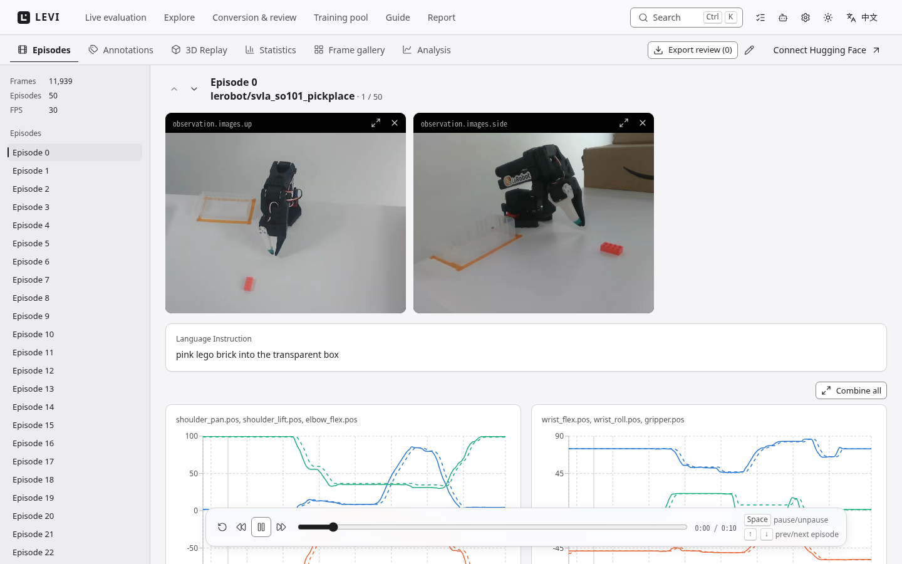
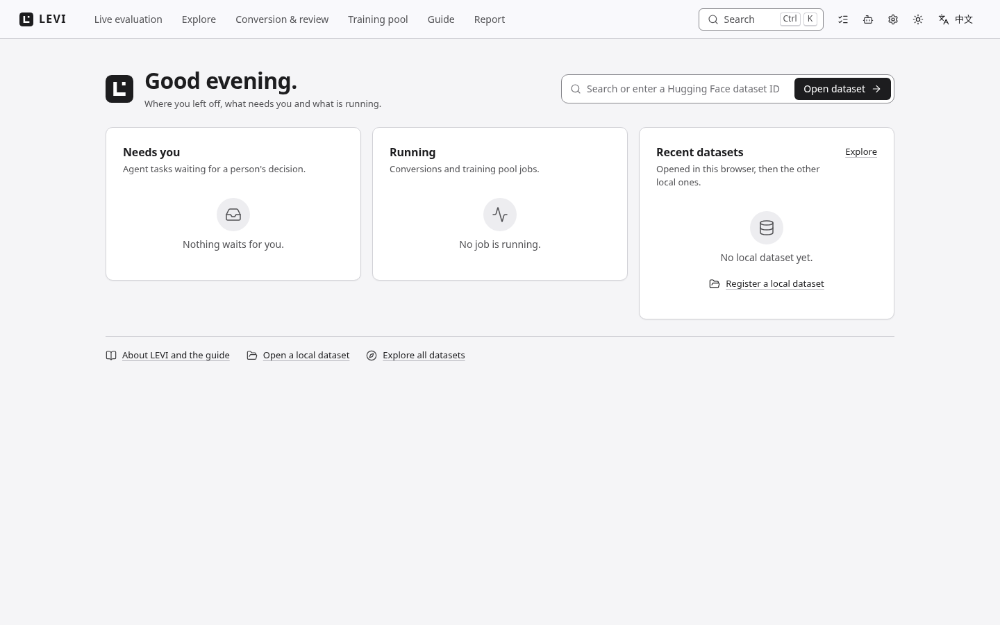

# LEVI · Robot Data Atelier

**LeRobot Exploration, Validation & Integration**

[](https://github.com/Koooki3/LEVI/actions/workflows/test.yml) [](LICENSE) [](CHANGELOG.md)

English · [简体中文](README.zh-CN.md)

LEVI is a local workbench for robot-learning data. It browses LeRobot datasets and raw robot captures, converts them into training formats, checks their quality, and labels them with AI agents and local vision-language models; a person reviews every suggestion before it is published (the one exception is the live service's audited auto-approver, described below). It runs on your machine: source data is never modified, and nothing leaves the machine unless you connect a remote model.

<picture>
  <source media="(prefers-color-scheme: dark)" srcset="docs/assets/ui-viewer-en-dark.png">
  
</picture>

## Why

A robot policy is only as good as the data it learns from, and the data is full of episodes that failed, drifted or were mislabelled. LEVI answers one question: **with limited compute, human review and robot time, what should be done with robot data so that the next policy gets better?** It inspects data again, repairs labels, changes how data enters training, and keeps a measured record of what each step cost and whether it helped.

## What it does

| | |
| --- | --- |
| **Browse and analyze** | Synchronized multi-camera playback, state/action charts, statistics, a frame gallery, Action Insights and 3D robot replay for LeRobot v2.0–v3.1, local or on the Hugging Face Hub. Derived from the [LeRobot Dataset Visualizer](https://github.com/huggingface/lerobot-dataset-visualizer). |
| **Convert** | Raw captures (CSV + video or image folders) and LeRobot v2.x into **LeRobot v2.1** or a **RECAP (π\*0.6) value dataset**, after an inspection that lists which requirements the input meets. |
| **Check and curate** | Structural quality checks, outcome labels, review flags, and agent-driven content review. A **release-anchored review** judges success at the moments the robot's own signals mark, such as each gripper opening, with one narrow question per event. |
| **Annotate with agents** | Time segments, events and object masks proposed by an external MCP agent (Claude Code, Codex, …), an API model or a **local model** (Ollama or vLLM), then reviewed, committed and undoable by a person. |
| **Label live evaluations** | A background service labels policy rollouts while a robot evaluation is still writing them, and yields the GPU to the policy. See [Live annotation](#live-annotation-of-robot-evaluations). |
| **Training pool** | Index every dataset under the read-only folders named in `LEVI_POOL_ROOTS` per episode, group copies, hold out frozen test episodes, compose tasks in a chosen order and export a merged LeRobot v2.1, RECAP value or raw-capture dataset with a provenance record. |
| **Segment objects fast** | A small student model distilled from SAM3 outlines and tracks objects while an episode plays and labels whole datasets offline; results are `suggested` annotations until a person reviews them. |
| **Feed training** | A RECAP value model gives per-frame values and advantage labels. Training manifests state which frames enter a learner's loss and with what weight. |
| **Learn from every task** | The harness closes each task with a ledger, the measured token and time cost, a memory of what was verified on that dataset, and improvement candidates a person can publish. |

## What has been measured

The numbers below come from the project's own experiments on one task family (plates stacking) unless stated otherwise; they come from the project's own experiment record, which is not shipped in this repository; [Validation](docs/VALIDATION.md) documents the anchored-review re-run.

- **Judging success is the clear gain.** Release-anchored review raised balanced accuracy on a blind 60-episode test set from 0.81 to 0.94 and cut "failure judged as success" from 38.5% to 12.8%, without missing a real success.
- **Time-segment labelling is at parity.** LEVI and a direct call of the same local model score alike against blind gold labels (segment F1 about 0.34). LEVI takes about 1.7× the direct call's wall time (development set, candidate configuration; 3.6× before the speed-up).
- **A second task did not meet the bar.** On the second task (screws) anchored review reached a balanced accuracy of 0.76, with 49% of failures judged successes; the quality gate for scaling up is not met.
- **Not established:** whether training on LEVI-curated data improves a robot policy. A downstream training experiment is under way; there is no result yet.

## Quick start

Requires [uv](https://docs.astral.sh/uv/getting-started/installation/) and FFmpeg (`sudo apt install ffmpeg` or `brew install ffmpeg`). Linux x86_64 is tested; macOS works; use WSL2 on Windows. The full guide, optional parts and running LEVI as a service: [INSTALL.md](INSTALL.md) ([中文](INSTALL.zh-CN.md)); an AI agent installing LEVI follows [INSTALL.agent.md](INSTALL.agent.md). `uv run levi install --profile core` does the steps below in one go, and `uv run levi doctor` checks the machine.

```bash
git clone https://github.com/Koooki3/LEVI.git
cd LEVI
export LEVI_WORKSPACE="$PWD/.state"          # where datasets and LEVI's state live
export UV_CACHE_DIR="$LEVI_WORKSPACE/.cache/uv"
export UV_PYTHON_INSTALL_DIR="$PWD/.runtime/python"
cp .env.example .env
uv sync --locked --extra agent
uv run levi setup                             # checksum-verified Bun + frontend dependencies
uv run levi build
uv run levi                                   # starts the Web UI and the API
```

Wait for **Ready** and open **http://127.0.0.1:7860**. The **Explore** page lists two public LeRobot datasets ([svla_so101_pickplace](https://huggingface.co/datasets/lerobot/svla_so101_pickplace), [aloha_static_coffee](https://huggingface.co/datasets/lerobot/aloha_static_coffee)) that stream on demand. Put your own datasets or raw captures under `$LEVI_WORKSPACE`; they are registered automatically. Ctrl+C stops both services. On a remote server, forward the Web UI port: `ssh -L 7860:127.0.0.1:7860 user@server`. Port 7861 is the internal API, not the workbench.

For a strict CPU-only session, set `export LEVI_CPU_ONLY=1` before starting: it disables the background GPU watcher and blocks local accelerator-backed inference, SAM3, fast segmentation and RECAP value models.

```bash
uv run levi doctor              # is this machine ready (read only; --json)
uv run levi stop                # stop the shared service and its workers; refuses while jobs run (--wait [min], --force; --all: also LEVI's Ollama)
uv run levi clean               # preview regenerable caches (service stopped); --apply to remove
uv run levi migrate             # preview upgrading an older workspace; --apply to apply
uv run levi convert --help
uv run levi agent --help        # tasks, connections, reviews, memory, improvements from a terminal
uv run levi namespace --help    # isolated experiments over one dataset
uv run levi recap --help        # RECAP value checkpoints and advantage labels
uv run levi export --help       # training manifests
uv run levi pool --help         # training pool: scan, recipes, exports, remote push
uv run levi live --help         # the background live annotation service
uv run levi docs check          # documentation against the code (docs sync regenerates)
```

## The interface

The LEVI mark opens **Home** (what needs you, what is running); the header opens **Live evaluation**, **Explore**, **Conversion & review**, **Training pool**, **Guide** and **Report**, plus Jobs, the **Agent Workbench**, settings, theme and language. `Ctrl+K` (⌘K on macOS) opens the command palette (pages, datasets, actions); `G` then `H`, `E`, `W`, `P`, `L`, `R` or `U` jumps to a page; `?` lists the shortcuts. The interface is light or dark, following the system or your choice, uses system fonts only, and has a reduced-motion setting. See the [Design system](docs/DESIGN.md).

<picture>
  <source media="(prefers-color-scheme: dark)" srcset="docs/assets/ui-home-en-dark.png">
  
</picture>

## Live annotation of robot evaluations

`levi live` is a background LEVI that watches the folders a robot evaluation writes and labels each finished episode with a local model (Qwen3.8 on vLLM): time segments, segment outcomes and a whole-episode success verdict. It is a separate instance with its own workspace and never writes the rollout folders, connects to the robot or writes human outcome labels. Its verdicts are automatic and unreviewed everywhere they appear, and are never written as a human label; you review them in the normal viewer, and the **Live evaluation** page shows progress. `--auto-approve` lets the service's audited automatic approver commit the time segments of its own runs, in its own workspace only, marked `auto`; without it each batch waits for a person at up to three gates. It needs the vLLM environment and weights ([vLLM](docs/VLLM.md), or `uv run levi install --profile live`) and an NVIDIA GPU with room for the model beside the policy.

```bash
uv run levi live init --root /path/to/rollouts      # once per machine: writes ~/.levi-live/workspace/live.toml
uv run levi live doctor                             # what is missing
uv run levi live start --daemon --auto-approve --prewarm
uv run levi live status                             # wait for vLLM ready or asleep
uv run levi live stop                               # stops only its own processes
```

One GPU is shared with the robot's policy server: the service opens a gate so the model never works while the policy is inferring, puts vLLM to sleep when idle, and, if a shared lock file is configured, holds that lock while its model server is up (with `--prewarm`: from start until `levi live stop`, about 2.2 GB even asleep). Start it before the policy server. [Live annotation service](docs/LIVE.md) ([中文](docs/LIVE.zh-CN.md)) has the settings, the GPU rules and the audit trail.

## Agents, with a person in charge

An agent reads sampled evidence and proposes; only a person approves a plan, accepts a pilot and commits (the live service's auto-approver above is the one exception). The boundary is enforced in one capability layer shared by the web UI, REST, MCP and the CLI. Every suggestion cites the frames it was read from, uncertainty is a valid answer, and a commit can be undone through the same review.

| Channel | Model | Set up with |
| --- | --- | --- |
| External MCP | Your own agent (Claude Code, Codex, any MCP client) | `uv run levi agent connect --client claude --project <dir> --dataset local/<name> --apply` |
| Online | An OpenAI-compatible endpoint, metered by LEVI | Agent Workbench → Accounts & connections |
| Local | An Ollama model on this machine (default `qwen3.5:4b`) or a local vLLM server, metered, no API key | [Local models](docs/OLLAMA.md), [vLLM](docs/VLLM.md) |
| Managed Pilot | A Codex or Claude Code session LEVI supervises | [Pilot](docs/PILOT.md) |

A task goes **plan → approve → pilot → review pilot → remaining episodes → review → commit**. With a local model, one sentence can start it:

```bash
uv run levi agent task new "Check the quality of <dataset>, then annotate subtasks on the first 10 demos and report tokens and time" --provider qwen-local
```

LEVI checks the spec against the catalog and waits for your approval before anything runs. Around every task the **harness** records tokens and time per agent and per dataset, keeps a memory of human-verified facts that the next task starts from, and files improvement candidates you can evaluate and publish. See [Agents](docs/AGENTS.md) and [Anchored review](docs/ANCHORED_REVIEW.md).

## Documentation

| Topic | Guides |
| --- | --- |
| **Start** | [Install](INSTALL.md) · [中文](INSTALL.zh-CN.md) · [for agents](INSTALL.agent.md) · [Workspace](docs/WORKSPACE.md) · [Design system](docs/DESIGN.md) · [中文](docs/DESIGN.zh-CN.md) |
| **Data** | [Conversion](docs/CONVERSION.md) · [Data quality](docs/QUALITY.md) · [Training pool](docs/TRAINING_POOL.md) · [Reset export](docs/RESET_EXPORT.md) · [Training manifests](docs/TRAINING_MANIFEST.md) · [RECAP](docs/RECAP.md) · [Counterfactual data](docs/COUNTERFACTUAL.md) · [中文](docs/COUNTERFACTUAL.zh-CN.md) |
| **Agents and models** | [Agents](docs/AGENTS.md) · [Local models](docs/OLLAMA.md) · [中文](docs/OLLAMA.zh-CN.md) · [vLLM](docs/VLLM.md) · [中文](docs/VLLM.zh-CN.md) · [Crash recovery](docs/SUPERVISION.md) · [Pilot](docs/PILOT.md) · [中文](docs/PILOT.zh-CN.md) · [Built-in knowledge](docs/KNOWLEDGE.md) |
| **Coding-agent skills** | [Skill Loom for Codex and Claude Code](docs/SKILL_LOOM.md) · [中文](docs/SKILL_LOOM.zh-CN.md) |
| **Labelling methods** | [Live annotation service](docs/LIVE.md) · [中文](docs/LIVE.zh-CN.md) · [Anchored review](docs/ANCHORED_REVIEW.md) · [SAM3](docs/SAM3.md) · [Fast segmentation](docs/SEGMENTATION.md) · [Evaluation records](docs/EVALUATION.md) |
| **Reference** | [API](docs/API.md) · [Validation](docs/VALIDATION.md) · [Architecture status](docs/architecture/IMPLEMENTATION_STATUS.md) · [Automatic evaluation pipeline (AERI)](docs/AUTOMATIC_PIPELINE.md) · [中文](docs/AUTOMATIC_PIPELINE.zh-CN.md) · [Event intelligence](docs/EVENTS.md) · [中文](docs/EVENTS.zh-CN.md) · [Performance baseline and cache budget](docs/PERFORMANCE.md) · [中文](docs/PERFORMANCE.zh-CN.md) · [Upstream](docs/UPSTREAM.md) · [Releasing](docs/RELEASING.md) · [Changelog](CHANGELOG.md) · [Third-party notices](THIRD_PARTY_NOTICES.md) · [References and citation](docs/REFERENCES.md) |

The **Report** page shows a live technical report from a folder you name with `LEVI_REPORT_DIR` (read-only, may be outside the workspace); see [API](docs/API.md#technical-report--技术报告).

## Workspace and deployment

`LEVI_WORKSPACE` holds data and state and can live outside the checkout (default `.state/`). Datasets sit directly under it; LEVI's own state is under `outputs/LEVI/`; model weights under `checkpoints/`. LEVI follows the workspace while it runs: datasets copied in are registered, changed ones refreshed, removed ones dropped. A **namespace** (`uv run levi namespace create <dataset> <name>`) lets several experiments share one source dataset without copying it. To share one GPU with other tools, set `LEVI_GPU_LOCK_FILE` to a lock file they also honour. See [Workspace](docs/WORKSPACE.md).

DROID raw folders are a browse-and-annotate input, not a supported training conversion; see [Conversion](docs/CONVERSION.md#droid-raw-browsing-view) and the optional test sample in [Workspace](docs/WORKSPACE.md#droid-test-sample) (`uv run levi sample fetch droid` downloads 500 episodes, about 11.6 GiB, and browsing them needs `--extra droid`; nothing is downloaded unless you ask or set `LEVI_DROID_SAMPLE=on`).

LEVI is a single-user local workbench with file access. Hugging Face sign-in controls Hub access, not LEVI permissions. Never commit credentials or `.env`; put any shared deployment behind an authenticated reverse proxy and set `LEVI_SECURE_COOKIES=1` for HTTPS or Space embeds. The web page answers `127.0.0.1`, `localhost` and `[::1]` on any port; a reverse proxy, LAN address or host name must be listed in `LEVI_UI_ALLOWED_HOSTS` (e.g. `LEVI_UI_ALLOWED_HOSTS=levi.example.org`), and changes are accepted only from LEVI's own page, so scripts use the `levi` CLI. This guards against other web pages, not against programs on this machine ([Trust boundary of the web bridge](docs/API.md#trust-boundary-of-the-web-bridge--网页桥接的信任边界)). Hub upload is an explicit API action; conversion and saving never upload.

```bash
docker build -t levi:local .
docker run --rm -p 127.0.0.1:7860:7860 -v "$HOME/levi-data:/workspace" levi:local
```

Mapping another local port (`-p 127.0.0.1:8080:7860`) works as is; publishing on a LAN address or name needs `-e LEVI_UI_ALLOWED_HOSTS=<name>`. The image installs the core only; see the status below.

## Status and limits

The current release is **0.3.0**; `main` carries unreleased work listed in the [changelog](CHANGELOG.md): the agent harness and local models, release-anchored review, the live annotation service, fast instance segmentation, RECAP value labels, training manifests, the training pool, the redesigned interface and the report page.

- **Evidence is sampled.** Dense refinement looks where it is pointed and cannot prove that nothing happened elsewhere.
- **Quality is measured per dataset, not claimed.** Automated tests use fixtures and stub models. The anchored-review rules are validated on one task (plates) and did not generalise to the second task (screws) at the quality bar; the fast segmentation student is scored against SAM3's labels, not human labels; automatic live verdicts are unreviewed and over-call success on tasks that place several objects. Whether curated inputs improve a trained policy is not established here.
- **Not built.** MCP is stdio only. There is no multi-user access control, no OS-level offline sandbox and no GPU scheduler: the GPU guardian, the live gate and `LEVI_GPU_LOCK_FILE` are courtesy policies among cooperating processes.
- **Known gap.** With `--ui`, if the live service's core process dies while its page process lives, the supervisor does not notice yet; restart the service.
- **Not verified.** The Docker image has not been built or run.

Details: [Validation](docs/VALIDATION.md).

## Troubleshooting

- **`{"detail":"Not Found"}` or the API landing page** — you reached port 7861; open 7860 and check that your SSH or editor port forwarding targets server port 7860.
- **A local path is refused** — it must be a LeRobot dataset (`meta/info.json`) or a recognised raw capture (`task/demo_NNNN` or a DROID `demo_NNNN/trajectory.h5`), and its real path must be inside `LEVI_WORKSPACE`.
- **A conversion fails** — read the inspection checklist and the job log. Duplicate or missing frame ids, unknown gripper commands or video count mismatches stop it before anything is published; the source is never modified.
- **A local-model run is blocked** — the reason names the process using the GPU; the run resumes once the GPU has been free for `LEVI_GPU_QUIET_SECONDS`.
- **A SAM3, segmentation or RECAP action says the worker is missing** — each model runs in its own environment (`integrations/sam3`, `integrations/segmentation`, `integrations/recap_value`, each with its own `setup.sh` or README); the core never imports Torch. See [SAM3](docs/SAM3.md), [Fast segmentation](docs/SEGMENTATION.md), [RECAP](docs/RECAP.md).
- **Interrupted after a restart** — jobs are marked interrupted and never resume writing on their own; plan again.

## Development

```bash
uv sync --locked --group dev --extra agent
uv run levi check
mkdir -p "$LEVI_WORKSPACE/tmp/build"
uv run pytest --basetemp="$LEVI_WORKSPACE/tmp/build/pytest"
export PATH="$(ls -d "$PWD"/.runtime/bun-*):$PATH"   # the Bun that `levi setup` installed
bun run format && bun run validate                # type check, lint, format, frontend tests
uv run levi build
```

`levi check` runs the frontend validation, Ruff and `levi docs check`, which fails when the docs fall behind the code (`uv run levi docs sync` regenerates the generated sections). CI runs the same checks and a production build. Read [CONTRIBUTING](CONTRIBUTING.md) before submitting changes; report problems in [Issues](https://github.com/Koooki3/LEVI/issues). LEVI is licensed under Apache-2.0 and keeps the upstream `LICENSE`, `NOTICE` and [attribution](docs/UPSTREAM.md); see [third-party notices](THIRD_PARTY_NOTICES.md).

## Citing LEVI

If LEVI helps your work, please cite it: GitHub's "Cite this repository" button reads [`CITATION.cff`](CITATION.cff), and [docs/REFERENCES.md](docs/REFERENCES.md) has a BibTeX entry plus the works LEVI builds on (LeRobot, SAM 3, RF-DETR, RECAP/π\*0.6, openpi, vLLM, CAST, DROID and others), their licences and how to cite them. Cite the version you used (`v0.3.0`; later changes are under "Unreleased" in the [changelog](CHANGELOG.md)).
