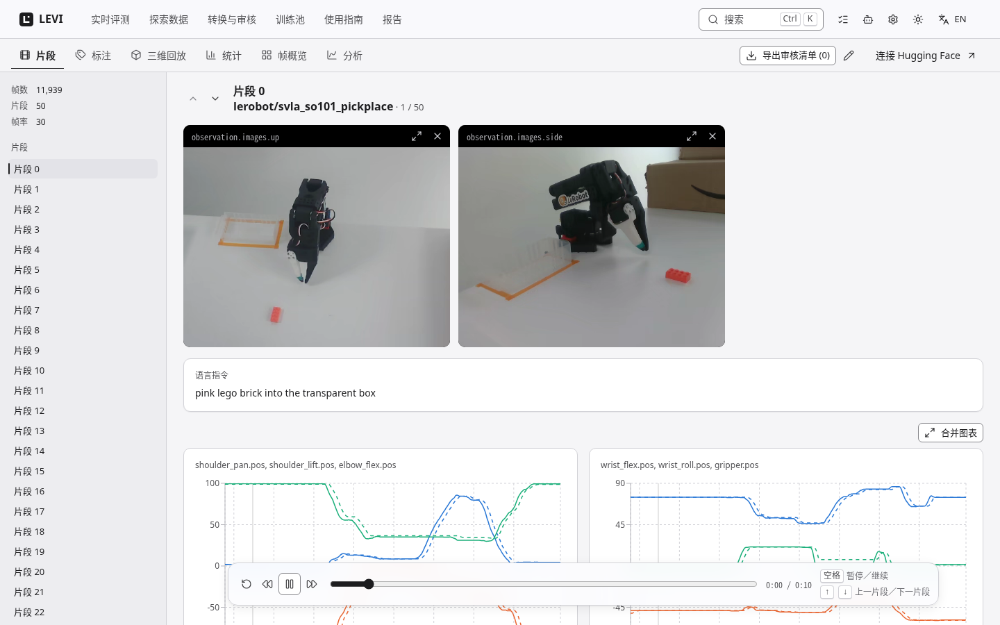
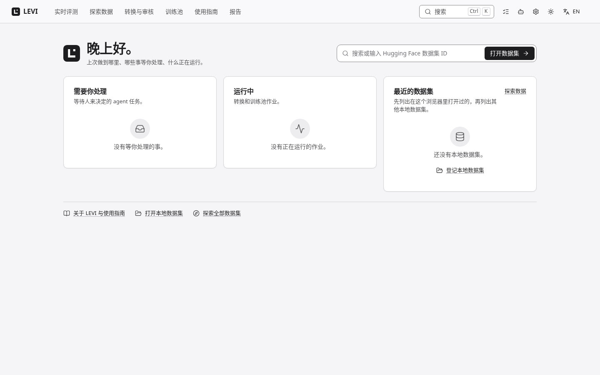

# LEVI · 机器人数据工坊

**LeRobot Exploration, Validation & Integration**

[](https://github.com/Koooki3/LEVI/actions/workflows/test.yml) [](LICENSE) [](CHANGELOG.md)

[English](README.md) · 简体中文

LEVI 是面向机器人学习数据的本地工作台：浏览 LeRobot 数据集和原始采集数据，转换成训练格式，检查数据质量，并用 AI agent 和本地视觉语言模型标注，每条建议都由人审核后才发布（唯一的例外是下文实时标注服务里有审计的自动批准主体）。它在你的机器上运行：不修改源数据；除非你连接远程模型，否则数据不会离开本机。

<picture>
  <source media="(prefers-color-scheme: dark)" srcset="docs/assets/ui-viewer-zh-dark.png">
  
</picture>

## 为什么做它

机器人策略的好坏取决于它学习的数据，而数据里有失败的、漂移的、标错的片段。LEVI 回答一个问题：**在算力、人工审核和机器人时间都有限时，对机器人数据做什么，下一个策略才会真的变好？** 它重新检查数据、修复标签、改变数据进入训练的方式，并记录每一步花了多少、有没有用。

## 它能做什么

| | |
| --- | --- |
| **浏览与分析** | 多相机同步回放、状态/动作曲线、统计、帧画廊、动作洞察和 3D 机器人回放，支持 LeRobot v2.0–v3.1，本地或 Hugging Face Hub。源自 [LeRobot Dataset Visualizer](https://github.com/huggingface/lerobot-dataset-visualizer)。 |
| **转换** | 把原始采集数据（CSV + 视频或图像文件夹）和 LeRobot v2.x 转成 **LeRobot v2.1** 或 **RECAP（π\*0.6）价值数据集**，转换前先检查并列出输入满足哪些要求。 |
| **检查与整理** | 结构性质量检查、成败标签、审核标记，以及由 agent 驱动的内容审核。**释放事件锚定复核**在机器人自己的信号标出的时刻（例如每次夹爪张开）判断成败，每个事件只问一个窄问题。 |
| **用 agent 标注** | 外部 MCP agent（Claude Code、Codex 等）、API 模型或**本地模型**（Ollama 或 vLLM）提出时间片段、事件和物体掩码，再由人审核、提交，可撤销。 |
| **为实时评测标注** | 后台服务在机器人评测还在写 rollout 时就标注，并给策略让出 GPU。见[实时标注](#机器人评测的实时标注)。 |
| **训练池** | 对 `LEVI_POOL_ROOTS` 指定的只读文件夹下的所有数据集逐片段建索引，副本归组，冻结测试片段强制留出；按选定顺序组合任务，导出带来源记录的合并 LeRobot v2.1、RECAP 价值或原始采集数据集。 |
| **快速物体分割** | 从 SAM3 蒸馏出的小型学生模型在片段播放时实时勾出并跟踪物体，也可离线标注整个数据集；结果在人审核之前都是“建议”标注。 |
| **服务训练** | RECAP 价值模型给出逐帧价值和优势标签；训练清单写明哪些帧进入学习器的损失、权重多少。 |
| **从每个任务中学习** | harness 为每个任务留下账本、实测的 token 和时间成本、该数据集上人工核实过的事实记忆，以及人可以发布的改进候选。 |

## 已经测到了什么

下面的数字来自本项目自己的实验，除非另有说明，都是一个任务族（叠盘子）上的结果；它们来自本项目自己的实验记录，该记录不随本仓库发布；[验证](docs/VALIDATION.md) 记录了锚定复核的重跑。

- **判断成败是明确的提升。** 释放事件锚定复核把盲测 60 个片段上的平衡准确率从 0.81 提到 0.94，“失败被判成功”从 38.5% 降到 12.8%，没有漏掉任何真成功。
- **时间片段标注与直接调用持平。** 对照盲建的金标准，LEVI 和同一本地模型的直接调用得分相近（时间片段 F1 约 0.34）。LEVI 的墙钟时间约为直接调用的 1.7 倍（开发集、候选配置；提速前是 3.6 倍）。
- **第二个任务没达标。** 在第二个任务（放螺丝，screws）上，锚定复核的平衡准确率是 0.76，49% 的失败被判成了成功，扩大规模的质量门槛没有满足。
- **尚未证明：** 用 LEVI 整理过的数据训练，机器人策略是否真的变好。下游训练实验正在进行，尚无结果。

## 快速开始

需要 [uv](https://docs.astral.sh/uv/getting-started/installation/) 和 FFmpeg（`sudo apt install ffmpeg` 或 `brew install ffmpeg`）。Linux x86_64 经过测试；macOS 可用；Windows 请用 WSL2。完整指南、可选组件和作为服务运行：[INSTALL.zh-CN.md](INSTALL.zh-CN.md)（[English](INSTALL.md)）；AI agent 安装 LEVI 请看 [INSTALL.agent.md](INSTALL.agent.md)。`uv run levi install --profile core` 一次做完下面的步骤，`uv run levi doctor` 检查这台机器。

```bash
git clone https://github.com/Koooki3/LEVI.git
cd LEVI
export LEVI_WORKSPACE="$PWD/.state"          # 数据集和 LEVI 状态所在的目录
export UV_CACHE_DIR="$LEVI_WORKSPACE/.cache/uv"
export UV_PYTHON_INSTALL_DIR="$PWD/.runtime/python"
cp .env.example .env
uv sync --locked --extra agent
uv run levi setup                             # 校验过哈希的 Bun 和前端依赖
uv run levi build
uv run levi                                   # 启动网页和 API
```

等到出现 **Ready**，打开 **http://127.0.0.1:7860**。**探索数据**页列出两个公开的 LeRobot 数据集（[svla_so101_pickplace](https://huggingface.co/datasets/lerobot/svla_so101_pickplace)、[aloha_static_coffee](https://huggingface.co/datasets/lerobot/aloha_static_coffee)），按需流式加载。把你自己的数据集或原始采集数据放在 `$LEVI_WORKSPACE` 下，会自动登记。Ctrl+C 同时停止两个服务。在远程服务器上，转发网页端口：`ssh -L 7860:127.0.0.1:7860 user@server`。7861 是内部 API，不是工作台。

只用 CPU 时，启动前设置 `export LEVI_CPU_ONLY=1`：它关闭后台 GPU 监视，并阻止本地加速器推理、SAM3、快速分割和 RECAP 价值模型。

```bash
uv run levi doctor              # 这台机器是否就绪（只读；--json）
uv run levi stop                # 停止共享服务及其工作进程；有作业运行时拒绝（--wait [分钟]、--force；--all：连 LEVI 的 Ollama 一起停）
uv run levi clean               # 预览可再生的缓存（需先停服务）；--apply 才删除
uv run levi migrate             # 预览升级旧工作区；--apply 才执行
uv run levi convert --help
uv run levi agent --help        # 在终端里管理任务、连接、审核、记忆、改进
uv run levi namespace --help    # 同一数据集上相互隔离的实验
uv run levi recap --help        # RECAP 价值检查点和优势标签
uv run levi export --help       # 训练清单
uv run levi pool --help         # 训练池：扫描、配方、导出、远程传输
uv run levi live --help         # 后台实时标注服务
uv run levi docs check          # 文档与代码是否一致（docs sync 重新生成）
```

## 界面

点 LEVI 标志回到 **首页**（要你处理的、正在运行的）；顶栏依次是 **实时评测**、**探索数据**、**转换与审核**、**训练池**、**使用指南**、**报告**，还有作业菜单、**Agent 工作台**、设置、主题和语言。`Ctrl+K`（macOS 是 ⌘K）打开命令面板（页面、数据集、操作）；按 `G` 再按 `H`、`E`、`W`、`P`、`L`、`R` 或 `U` 跳到对应页面；按 `?` 列出快捷键。界面浅色或深色，跟随系统或由你选择，只用系统字体，并有减少动效的设置。见[设计系统](docs/DESIGN.zh-CN.md)。

<picture>
  <source media="(prefers-color-scheme: dark)" srcset="docs/assets/ui-home-zh-dark.png">
  
</picture>

## 机器人评测的实时标注

`levi live` 是一个后台常驻的 LEVI：监视机器人评测写入的目录，用本地模型（vLLM 上的 Qwen3.8）标注每个已完成的片段：时间片段、各时间片段的成败，以及整个片段是否成功。它是独立的实例，有自己的工作区，不会写 rollout 目录、连接机器人或写人工成败标签。它的判定在所有地方都是自动、未经审核的，也从不写成人工标签；你在普通查看器里审核，**实时评测**页显示进度。`--auto-approve` 让服务里有审计的自动批准主体，只在它自己的工作区里，批准并提交它自己那次运行的时间片段，并标记 `auto`；不加它，每个批次最多要等人过三道关。它需要 vLLM 环境和权重（[vLLM](docs/VLLM.zh-CN.md)，或 `uv run levi install --profile live`），以及能在策略旁边放下模型的 NVIDIA GPU。

```bash
uv run levi live init --root /path/to/rollouts      # 每台机器一次：写出 ~/.levi-live/workspace/live.toml
uv run levi live doctor                             # 缺什么
uv run levi live start --daemon --auto-approve --prewarm
uv run levi live status                             # 等到 vLLM 显示 ready 或 asleep
uv run levi live stop                               # 只停自己的进程
```

一块 GPU 与机器人的策略服务器共用：服务用“闸门”保证策略推理时模型不工作，空闲时让 vLLM 睡眠；如果配置了共享锁文件，模型服务运行期间就持有该锁（用 `--prewarm` 时：从启动一直到 `levi live stop`，睡眠时也占约 2.2 GB）。请在策略服务器之前启动它。设置、GPU 规则和审计记录见[实时标注服务](docs/LIVE.zh-CN.md)（[English](docs/LIVE.md)）。

## Agent 辅助，人负责

agent 读取抽样的证据并提出建议；只有人才能批准计划、验收试点和提交（上文实时服务的自动批准主体是唯一的例外）。这条边界由一个能力层统一执行，网页、REST、MCP 和命令行共用。每条建议都引用它读的帧，“不确定”是合法答案，提交可以通过同一套审核撤销。

| 渠道 | 模型 | 设置方式 |
| --- | --- | --- |
| 外部 MCP | 你自己的 agent（Claude Code、Codex 或任何 MCP 客户端） | `uv run levi agent connect --client claude --project <dir> --dataset local/<name> --apply` |
| 在线 | OpenAI 兼容端点，由 LEVI 计量 | Agent 工作台 → 账号与连接 |
| 本地 | 本机的 Ollama 模型（默认 `qwen3.5:4b`）或本地 vLLM 服务，计量，无需 API key | [本地模型](docs/OLLAMA.zh-CN.md)、[vLLM](docs/VLLM.zh-CN.md) |
| 托管 Pilot | LEVI 监督的 Codex 或 Claude Code 会话 | [Pilot](docs/PILOT.zh-CN.md) |

任务走 **计划 → 批准 → 试点 → 审核试点 → 其余片段 → 审核 → 提交**。用本地模型时，一句话就能启动：

```bash
uv run levi agent task new "Check the quality of <dataset>, then annotate subtasks on the first 10 demos and report tokens and time" --provider qwen-local
```

LEVI 会对照目录检查任务规格，并在运行前等你批准。每个任务前后，**harness** 按 agent 和数据集记录 token 与时间，保存人工核实过的事实记忆作为下一个任务的起点，并登记你可以评估和发布的改进候选。见 [Agents](docs/AGENTS.md) 和[锚定复核](docs/ANCHORED_REVIEW.md)。

## 文档

| 主题 | 指南 |
| --- | --- |
| **开始** | [安装](INSTALL.zh-CN.md) · [English](INSTALL.md) · [给 agent](INSTALL.agent.md) · [工作区](docs/WORKSPACE.md) · [设计系统](docs/DESIGN.zh-CN.md) · [English](docs/DESIGN.md) |
| **数据** | [转换](docs/CONVERSION.md) · [数据质量](docs/QUALITY.md) · [训练池](docs/TRAINING_POOL.md) · [复位导出](docs/RESET_EXPORT.zh-CN.md) · [训练清单](docs/TRAINING_MANIFEST.md) · [RECAP](docs/RECAP.md) · [反事实数据](docs/COUNTERFACTUAL.zh-CN.md) · [English](docs/COUNTERFACTUAL.md) |
| **Agent 与模型** | [Agents](docs/AGENTS.md) · [本地模型](docs/OLLAMA.zh-CN.md) · [English](docs/OLLAMA.md) · [vLLM](docs/VLLM.zh-CN.md) · [English](docs/VLLM.md) · [崩溃恢复](docs/SUPERVISION.md) · [Pilot](docs/PILOT.zh-CN.md) · [English](docs/PILOT.md) · [内置知识](docs/KNOWLEDGE.md) |
| **开发用技能** | [Codex 与 Claude Code 使用 Skill Loom](docs/SKILL_LOOM.zh-CN.md) · [English](docs/SKILL_LOOM.md) |
| **标注方法** | [实时标注服务](docs/LIVE.zh-CN.md) · [English](docs/LIVE.md) · [锚定复核](docs/ANCHORED_REVIEW.md) · [SAM3](docs/SAM3.md) · [快速分割](docs/SEGMENTATION.md) · [评测记录](docs/EVALUATION.md) |
| **参考** | [API](docs/API.md) · [验证](docs/VALIDATION.md) · [架构进度](docs/architecture/IMPLEMENTATION_STATUS.md) · [自动测评契约与运行日志](docs/AUTOMATIC_PIPELINE.zh-CN.md) · [English](docs/AUTOMATIC_PIPELINE.md) · [上游](docs/UPSTREAM.md) · [发布](docs/RELEASING.md) · [变更记录](CHANGELOG.md) · [第三方声明](THIRD_PARTY_NOTICES.md) · [参考文献与引用](docs/REFERENCES.md) |

**报告**页显示一份实时技术报告，目录由 `LEVI_REPORT_DIR` 指定（只读，可以在工作区之外）；见 [API](docs/API.md#technical-report--技术报告)。

## 工作区与部署

`LEVI_WORKSPACE` 存放数据和状态，可以放在检出目录之外（默认 `.state/`）。数据集直接放在它下面；LEVI 自己的状态在 `outputs/LEVI/`；模型权重在 `checkpoints/`。LEVI 运行时跟随工作区：复制进来的数据集自动登记，改动的刷新，删掉的移除。**命名空间**（`uv run levi namespace create <dataset> <name>`）让多个实验共用同一份源数据集而不复制。要与其他工具共用一块 GPU，把 `LEVI_GPU_LOCK_FILE` 设为它们也遵守的锁文件。见[工作区](docs/WORKSPACE.md)。

DROID 原始文件夹只是“浏览并标注”的输入，不是受支持的训练转换；见[转换](docs/CONVERSION.md#droid-raw-browsing-view)，可选的测试样本见[工作区](docs/WORKSPACE.md#droid-test-sample)（`uv run levi sample fetch droid` 会下载 500 个片段，约 11.6 GiB，浏览它们需要 `--extra droid`；除非你要求或设置 `LEVI_DROID_SAMPLE=on`，否则不会下载）。

LEVI 是单用户、能访问本地文件的工作台。Hugging Face 登录只控制 Hub 访问，不是 LEVI 的权限。不要提交凭据或 `.env`；任何共享部署都应放在带认证的反向代理后面，并为 HTTPS 或 Space 嵌入设置 `LEVI_SECURE_COOKIES=1`。上传到 Hub 是明确的 API 动作；转换和保存从不上传。

```bash
docker build -t levi:local .
docker run --rm -p 127.0.0.1:7860:7860 -v "$HOME/levi-data:/workspace" levi:local
```

镜像只安装核心；见下面的状态。

## 状态与限制

当前发布版本是 **0.3.0**；`main` 带有 [变更记录](CHANGELOG.md) 中尚未发布的工作：agent harness 和本地模型、释放事件锚定复核、实时标注服务、快速实例分割、RECAP 价值标签、训练清单、训练池、重新设计的界面和报告页。

- **证据是抽样的。** 密集精修只看它被指向的地方，不能证明别处什么都没发生。
- **质量按数据集实测，不作笼统宣称。** 自动化测试用的是夹具和替身模型。锚定复核规则在一个任务（叠盘子）上验证过，在第二个任务（screws）上没有达到质量门槛；快速分割的学生模型是对照 SAM3 的标签打分，不是人工标签；实时服务的自动判定未经审核，在需要放多个物体的任务上偏向判成功。用整理过的输入训练是否改善策略，这里没有证明。
- **没有做。** MCP 只有 stdio。没有多用户权限控制，没有系统级离线沙箱，没有 GPU 调度器：GPU 守卫、实时闸门和 `LEVI_GPU_LOCK_FILE` 都是互相配合的进程之间的约定。
- **已知缺口。** 带 `--ui` 时，实时服务的核心进程死了而页面进程还活着，监督进程暂时不会发现；请重启服务。
- **未验证。** Docker 镜像没有构建或运行过。

详情：[验证](docs/VALIDATION.md)。

## 常见问题

- **`{"detail":"Not Found"}` 或 API 说明页** — 你访问到了 7861 端口；请打开 7860，并检查 SSH 或编辑器的端口转发目标是服务器的 7860 端口。
- **本地路径被拒绝** — 它必须是 LeRobot 数据集（`meta/info.json`）或可识别的原始采集（`task/demo_NNNN` 或 DROID 的 `demo_NNNN/trajectory.h5`），并且真实路径必须在 `LEVI_WORKSPACE` 之内。
- **转换失败** — 看检查清单和作业日志。帧编号重复或缺失、夹爪指令未知、视频数量对不上，都会在发布任何东西之前停下；源数据从不被修改。
- **本地模型运行被阻塞** — 原因里会写出占用 GPU 的进程；GPU 空闲满 `LEVI_GPU_QUIET_SECONDS` 后会继续。
- **SAM3、分割或 RECAP 操作提示 worker 缺失** — 每个模型在自己的环境里运行（`integrations/sam3`、`integrations/segmentation`、`integrations/recap_value`，各有自己的 `setup.sh` 或 README）；核心从不导入 Torch。见 [SAM3](docs/SAM3.md)、[快速分割](docs/SEGMENTATION.md)、[RECAP](docs/RECAP.md)。
- **重启后被中断** — 作业会被标记为中断，不会自己继续写入；请重新规划。

## 开发

```bash
uv sync --locked --group dev --extra agent
uv run levi check
mkdir -p "$LEVI_WORKSPACE/tmp/build"
uv run pytest --basetemp="$LEVI_WORKSPACE/tmp/build/pytest"
export PATH="$(ls -d "$PWD"/.runtime/bun-*):$PATH"   # `levi setup` 安装的 Bun
bun run format && bun run validate                # 类型检查、lint、格式、前端测试
uv run levi build
```

`levi check` 运行前端验证、Ruff 和 `levi docs check`；文档落后于代码时 `levi docs check` 会失败（`uv run levi docs sync` 重新生成自动生成的部分）。CI 运行同样的检查和生产构建。提交改动前请读 [CONTRIBUTING](CONTRIBUTING.md)；问题请提到 [Issues](https://github.com/Koooki3/LEVI/issues)。LEVI 采用 Apache-2.0 许可证，保留上游的 `LICENSE`、`NOTICE` 和[署名](docs/UPSTREAM.md)；见[第三方声明](THIRD_PARTY_NOTICES.md)。

## 引用 LEVI

LEVI 对你的工作有帮助的话，欢迎引用：GitHub 的“Cite this repository”按钮读取 [`CITATION.cff`](CITATION.cff)；[docs/REFERENCES.md](docs/REFERENCES.md) 给出 BibTeX，以及 LEVI 所基于的工作（LeRobot、SAM 3、RF-DETR、RECAP/π\*0.6、openpi、vLLM、CAST、DROID 等）、它们的许可证和引用方式。请引用你所用的版本（`v0.3.0`；之后的改动见[变更记录](CHANGELOG.md)的 Unreleased）。
