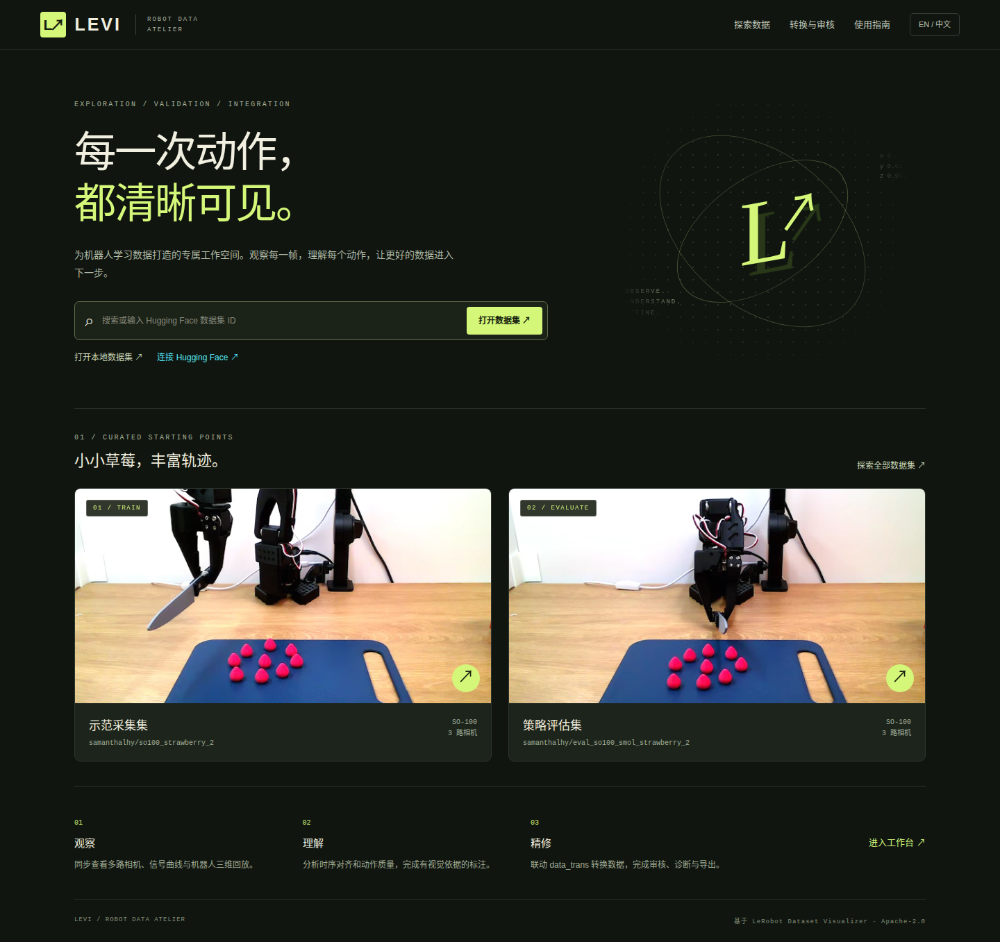

# LEVI · 机器人数据工坊

**LeRobot Exploration, Validation & Integration**

[](https://github.com/Koooki3/LEVI/actions/workflows/test.yml) [](LICENSE) [](CHANGELOG.md)

[English](README.md) · 简体中文

LEVI 是面向机器人学习数据的本地工作台：浏览 LeRobot 数据集和原始采集数据，转换成训练格式，检查数据质量，并用 AI agent 辅助标注——每条建议都要经人审核才会发布。它在你自己的机器上运行：源数据不会被修改；除非你接入远程模型，数据不会离开本机。



## 能做什么

| | |
| --- | --- |
| **浏览与分析** | 多相机同步播放、状态/动作曲线、统计、筛选、首尾帧概览、动作洞察和 3D 机器人回放；支持 LeRobot v2.0–v3.1，数据可在本地或 Hugging Face Hub 上。源自 [LeRobot Dataset Visualizer](https://github.com/huggingface/lerobot-dataset-visualizer)。 |
| **转换** | 把原始采集（CSV + 视频或图片目录）和 LeRobot v2.x 转成 **LeRobot v2.1** 或 **RECAP（π\*0.6）价值数据集**；转换前先检查输入，逐项列出满足了哪些要求。单遍、并行处理，并提供无损重定时模式。原始采集在转换前就能浏览和标注，标注会随转换带到输出中。 |
| **训练池** | 把只读目录下的所有数据集逐片段登记（原始采集、LeRobot v2.x、DROID；人工采集、策略 rollout、LEVI 处理后），副本和过滤版本归为一组，冻结测试集自动留出。按指定顺序组合任务，每个任务可指定片段数和成功占比，导出合并的 LeRobot v2.1（openpi / π0.5）、RECAP 价值数据集或原始采集目录，并附来源记录。用 `LEVI_POOL_ROOTS` 指定要登记的目录。 |
| **检查与治理** | 逐片段的结构化质量检查（时间戳、动作、视频、元数据）、片段结局标签、审核标记，以及由 agent 完成的内容审查：这条 demo 实际演示的是什么任务、有没有成功。释放事件锚定复核（简称锚定复核）在机器人自身信号标出的时刻（例如每次夹爪张开）判断成败，每个事件只问模型一个窄问题。 |
| **agent 辅助标注** | 子任务时间片段、事件和物体掩码由外部 MCP agent（Claude Code、Codex 等）、API 模型或**本地模型**（Ollama 或 vLLM 服务）提出，再由人审核、提交，提交后可撤销。一句自然语言就能发起完整任务。 |
| **快速物体分割** | 从 SAM3 蒸馏出的小型学生模型在播放片段时实时勾画并跟踪物体，也可离线标注整个数据集；SAM3 仍是质量优先的路径。结果是普通的物体标注，人工审核前一律是 `suggested`。 |
| **服务训练** | RECAP 价值模型给出逐帧价值和优势标签，在片段查看页显示。训练清单说明哪些帧以什么权重进入训练 loss，并附来源记录，训练端用独立读取器应用。 |
| **每个任务都沉淀经验** | 每个任务结束时，harness 写下任务账本、实测的 token 与耗时、该数据集上经人验证的本地记忆，以及改进项；改进项经人发布后供下一个任务使用。 |

页头依次打开 **探索数据**（浏览与分析）、**转换与审核**（转换、登记、检查）、**训练池**、**使用指南**、**报告**，以及 **Agent 工作台**和**账号与连接**面板。

## 快速上手

需要 [uv](https://docs.astral.sh/uv/getting-started/installation/) 和 FFmpeg（`sudo apt install ffmpeg` 或 `brew install ffmpeg`）。已在 Linux x86_64 上测试；macOS 可用；Windows 请用 WSL2。

```bash
git clone https://github.com/Koooki3/LEVI.git
cd LEVI
export LEVI_WORKSPACE="$PWD/.state"          # 数据集与 LEVI 状态所在目录
export UV_CACHE_DIR="$LEVI_WORKSPACE/.cache/uv"
export UV_PYTHON_INSTALL_DIR="$PWD/.runtime/python"
cp .env.example .env
uv sync --locked --extra agent
uv run levi setup                             # 安装经校验的 Bun 与前端依赖
uv run levi build
uv run levi                                   # 同时启动网页与 API
```

看到 **Ready** 后打开 **http://127.0.0.1:7860**。首页用两个公开的 LeRobot 数据集（[svla_so101_pickplace](https://huggingface.co/datasets/lerobot/svla_so101_pickplace)、[aloha_static_coffee](https://huggingface.co/datasets/lerobot/aloha_static_coffee)）作演示，按需流式读取。你自己的数据集或原始采集放进 `$LEVI_WORKSPACE` 后会自动登记。Ctrl+C 同时停止两个服务。

在远程服务器上运行时，请转发网页端口：`ssh -L 7860:127.0.0.1:7860 user@server`。7861 是内部 API，不是工作台页面。

如需严格只用 CPU，请在启动服务前设置 `export LEVI_CPU_ONLY=1`。这会关闭后台 GPU 监测，并禁止依赖加速器的本地推理、SAM3、快速分割和 RECAP 价值模型（测试用的 fake 提供者仍可运行）。

DROID 原始目录（`demo_0000/trajectory.h5`、元数据及三路 MP4）是可选的**浏览与标注输入**，不支持转换成训练数据。使用前运行 `uv sync --locked --extra agent --extra droid`，把数据集目录直接放进 `$LEVI_WORKSPACE`，然后点击 **立即同步** 或重启 LEVI。只读派生视图位于 `outputs/LEVI/workbench/views/<数据集名>/`，HDF5 源文件不会被改动。源 MP4 时间与控制时间不一致，因此视图采用名义 14.3 FPS；原始时间戳和逐片段偏差记录在 `meta/levi_provenance.jsonl`，确定精确时间边界时应对照该记录复核。详见[转换指南](docs/CONVERSION.md#droid-raw-browsing-view)。新建的工作区还会自动下载一份 DROID 测试数据集：按固定种子确定的顺序，从公开发布版中抽取 500 个片段，在后台下载约 11.6 GiB（设置 `LEVI_DROID_SAMPLE=off` 可跳过；`uv run levi sample draw` 可再抽 500 个，与之前的抽取不重复），详见 [DROID 测试样本](docs/WORKSPACE.md#droid-test-sample)。

```bash
uv run levi stop                # 停止共享服务及其子进程（--all：连同 LEVI 启动的 Ollama）
uv run levi clean               # 预览可再生缓存（需先停服务）；加 --apply 执行
uv run levi migrate             # 预览旧工作区的升级；加 --apply 执行
uv run levi convert --help
uv run levi agent --help        # 在终端里管理任务、连接、审核、记忆与改进项
uv run levi namespace --help    # 同一数据集上相互隔离的实验
uv run levi recap --help        # RECAP 价值检查点与优势标签
uv run levi export --help       # 训练清单
uv run levi pool --help         # 训练池：扫描、方案、导出、远程推送
uv run levi docs check          # 对照代码检查文档（docs sync 重新生成）
```

## agent 辅助，人来把关

agent 读取采样证据并提出建议；只有人能批准计划、验收试标、提交结果。这条边界在网页、REST、MCP 和 CLI 共用的能力层中强制执行。每条建议都注明依据的帧，“不确定”是合法答案；提交后也能经同样的审核流程撤销。

| 通道 | 模型 | 配置方式 |
| --- | --- | --- |
| 外部 MCP | 你自己的 agent（Claude Code、Codex 或任意 MCP 客户端） | `uv run levi agent connect --client claude --project <目录> --dataset local/<名称> --apply` |
| 在线 | OpenAI 兼容端点，由 LEVI 计量 | Agent 工作台 → 账号与连接 |
| 本地 | 本机 Ollama 模型（默认 `qwen3.5:4b`）或本地 vLLM 服务，由 LEVI 计量，无需 API key | [本地模型](docs/OLLAMA.zh-CN.md) |
| 托管 Pilot | 由 LEVI 监督的 Codex 或 Claude Code 会话 | [Pilot](docs/PILOT.zh-CN.md) |

一个任务的流程是 **规划 → 批准 → 试标 → 试标验收 → 其余片段 → 审核 → 提交**。使用本地模型时，一句话就能发起：

```bash
uv run levi agent task new "对 <数据集> 进行数据质量检查，然后对前10条demo进行子任务标注，最后给出全流程token和耗时统计" --provider qwen-local
```

LEVI 会对照数据目录校验解析出的任务规格，等你批准后才执行。每个任务前后，**harness** 都会记录成本（token 与耗时，按 agent 和数据集统计），保存经人验证的事实作为下一个任务的起点，并提出改进项，由你评估和发布。GPU 与机器人训练共用时，本地模型错峰运行并自动让路；vLLM 配置可同时处理多个片段（`requests_in_flight`）。详见 [Agents](docs/AGENTS.md)；锚定复核的细节见[锚定复核](docs/ANCHORED_REVIEW.md)。

## 文档

| 指南 | 内容 |
| --- | --- |
| [Agents](docs/AGENTS.md) | 通道、任务生命周期、自然语言任务、证据、物体掩码、harness（成本、记忆、自改进、教师监督）、能力参考 |
| [本地模型](docs/OLLAMA.zh-CN.md) · [English](docs/OLLAMA.md) | Ollama 安装、本地 vLLM 服务、模型绑定、精简提示模式、并发请求、GPU 错峰使用、师生学习循环 |
| [Pilot](docs/PILOT.zh-CN.md) · [English](docs/PILOT.md) | 托管的 Codex / Claude Code 会话 |
| [锚定复核](docs/ANCHORED_REVIEW.md) | 在每个记录到的机器人事件处判断片段：规格、起始检查与否决规则、锚点、记录、实测一致性 |
| [数据质量](docs/QUALITY.md) | 结构化检查、内容审查、结局标签、审核标记与审核清单 |
| [转换](docs/CONVERSION.md) | 输入格式、检查、帧时间模式、选项、性能、溯源 |
| [RECAP](docs/RECAP.md) | RECAP 价值数据集导出，以及在 LEVI 中运行 RECAP 价值模型：检查点、逐帧价值、优势标签 |
| [训练池](docs/TRAINING_POOL.md) | 扫描只读数据目录、归并副本、留出测试集、组合并导出合并后的训练数据集 |
| [训练清单](docs/TRAINING_MANIFEST.md) | 哪些帧以什么权重进入训练 loss，附完整来源记录；训练端读取器 |
| [SAM3](docs/SAM3.md) | 可选的模型辅助物体掩码 |
| [快速分割](docs/SEGMENTATION.md) | 播放片段时实时叠加实例分割、快速标注数据集、从 SAM3 蒸馏学生模型 |
| [评测记录](docs/EVALUATION.md) | 记录人工标注过程；人工与 agent 子任务标注按模式的质量与成本记录 |
| [内置知识](docs/KNOWLEDGE.md) | LEVI 中所有模型都遵循的、与数据集无关的规则，以及本地记忆如何提升为内置知识 |
| [工作区](docs/WORKSPACE.md) | `LEVI_WORKSPACE` 下各类文件的位置、命名、同步、LEVI 启动的进程、命名空间、DROID 测试样本与清理 |
| [API](docs/API.md) | REST 路由与 agent 能力 |
| [验证记录](docs/VALIDATION.md) | 测了什么、用什么测、哪些还没测 |
| [架构进展](docs/architecture/IMPLEMENTATION_STATUS.md) | 相对架构规划的实现进度 |
| [上游](docs/UPSTREAM.md) · [发布](docs/RELEASING.md) · [更新日志](CHANGELOG.md) | 来源与功能对照、发布流程、变更记录 |

## 工作区

`LEVI_WORKSPACE` 存放数据和状态，可以放在仓库之外（默认 `.state/`）。数据集直接放在它下面；LEVI 自己的状态在 `outputs/LEVI/`；模型权重在 `checkpoints/`。文件按数据集和片段命名（`episode_000007`），每次运行用可读的时间戳命名（`temporal-20260922T0941`），从不使用哈希。LEVI 运行期间持续跟踪工作区：拷入的数据集自动登记，有变化的会刷新，删除的会移除。详见 [工作区](docs/WORKSPACE.md)。

**命名空间**（`uv run levi namespace create <数据集> <名称>`）让多个实验共用一个源数据集而无需复制：各自保留自己的标注、运行、记忆和记录（[工作区](docs/WORKSPACE.md#namespaces-one-input-many-experiments)）。与其他工具共用一块 GPU 时，把 `LEVI_GPU_LOCK_FILE` 设为大家都遵守的锁文件，分割标注和蒸馏作业会在它上面排队（[快速分割](docs/SEGMENTATION.md#settings--设置)）。

**报告**页显示 `LEVI_REPORT_DIR` 所指目录中的实时技术报告（只读，目录可在工作区之外），见 [API](docs/API.md#technical-report--技术报告)。

## 部署

LEVI 是有文件访问权限的单用户本地工作台。Hugging Face 登录（令牌、OAuth 或后端的 `HF_TOKEN`）只控制 Hub 访问，不是 LEVI 的用户权限；浏览器中的令牌保存在本地存储和一个 HttpOnly 视频代理 cookie 里，退出登录时清除。不要提交凭据或 `.env`；共享部署请放在带认证的反向代理之后，使用 HTTPS 或 Space 嵌入时设置 `LEVI_SECURE_COOKIES=1`。上传到 Hub 必须显式调用 API；转换和保存从不上传。

```bash
docker build -t levi:local .
docker run --rm -p 127.0.0.1:7860:7860 -v "$HOME/levi-data:/workspace" levi:local
```

镜像只安装核心（`uv sync --locked --no-dev`，不含 `agent` 扩展），且未经构建或运行验证，见[现状与限制](#现状与限制)。

## 现状与限制

当前发布版本为 **0.3.0**；`main` 分支包含尚未发布的工作，见[更新日志](CHANGELOG.md)：agent harness 与本地模型（Ollama 和 vLLM）、释放事件锚定复核、快速实例分割、RECAP 价值标签、训练清单、训练池和报告页。

- **证据是采样得到的。** 密集细化只查看指定的区间，无法证明其他地方什么都没发生。
- **模型质量按数据集实测，不做笼统承诺。** 自动化测试使用固定样例和模拟模型；本地模型的标注质量仍在验证中。内置的锚定复核规则只在一个任务（plates）上验证过，带起始检查的候选规则集只在开发数据上验证过。快速分割的学生模型是对照 SAM3 的标注评分的，不是对照人工标注，上限就是接近 SAM3。RECAP 价值标签在一个真实检查点上核对过。训练清单和训练池导出的数据能否让训练出的策略变好，这里没有结论。
- **尚未实现。** MCP 目前只支持 stdio。没有多用户权限控制，没有操作系统级离线沙箱，也没有 GPU 调度器：GPU 守护和 `LEVI_GPU_LOCK_FILE` 只是协作进程之间的礼让约定。
- **尚未验证。** Docker 镜像没有构建或运行过，`Dockerfile` 还会复制仓库里已不存在的 `public/` 目录，改掉这一行之前 `docker build` 应会在该步骤停下。经过测试的平台是 Linux x86_64。

详见[验证记录](docs/VALIDATION.md)。

## 常见问题

- **看到 `{"detail":"Not Found"}` 或 API 说明页**：请求进入了 7861；请打开 7860，并确认 SSH 或编辑器的端口转发目标是服务器的 7860。
- **本地路径被拒绝**：必须是 LeRobot 数据集（含 `meta/info.json`）或可识别的原始采集（`task/demo_NNNN`，或 DROID 的 `demo_NNNN/trajectory.h5`），且真实路径位于 `LEVI_WORKSPACE` 内。
- **转换失败**：查看输入检查清单和任务日志。帧 ID 重复或缺失、夹爪指令未知、视频数量不符，都会在发布任何结果前中止转换；源数据不会被修改。
- **本地模型任务被阻塞**：原因中会写明正在使用 GPU 的进程；GPU 连续空闲 `LEVI_GPU_QUIET_SECONDS` 后任务继续。
- **SAM3、分割或 RECAP 操作提示找不到 worker**：每个模型都在自己的环境里运行（`integrations/sam3`、`integrations/segmentation`、`integrations/recap_value`，各有 `setup.sh` 或 README），核心从不导入 Torch。见 [SAM3](docs/SAM3.md)、[快速分割](docs/SEGMENTATION.md)、[RECAP](docs/RECAP.md)。
- **服务重启后任务中断**：任务会被标记为 interrupted，不会自行恢复写入；请重新规划。

## 开发

```bash
uv sync --locked --group dev --extra agent
uv run levi check
mkdir -p "$LEVI_WORKSPACE/tmp/build"
uv run pytest --basetemp="$LEVI_WORKSPACE/tmp/build/pytest"
export PATH="$(ls -d "$PWD"/.runtime/bun-*):$PATH"   # levi setup 安装的 Bun
bun run format && bun run validate                # 类型检查、lint、格式、前端测试
uv run levi build
```

`levi check` 运行前端校验、Ruff 和 `levi docs check`；文档落后于代码时它会失败（`uv run levi docs sync` 重新生成自动生成的部分）。CI 运行同样的检查和生产构建。提交改动前请阅读 [CONTRIBUTING](CONTRIBUTING.md)；问题请报告到 [Issues](https://github.com/Koooki3/LEVI/issues)。LEVI 采用 Apache-2.0 许可，保留上游的 `LICENSE`、`NOTICE` 与[来源说明](docs/UPSTREAM.md)；另见[第三方声明](THIRD_PARTY_NOTICES.md)。
