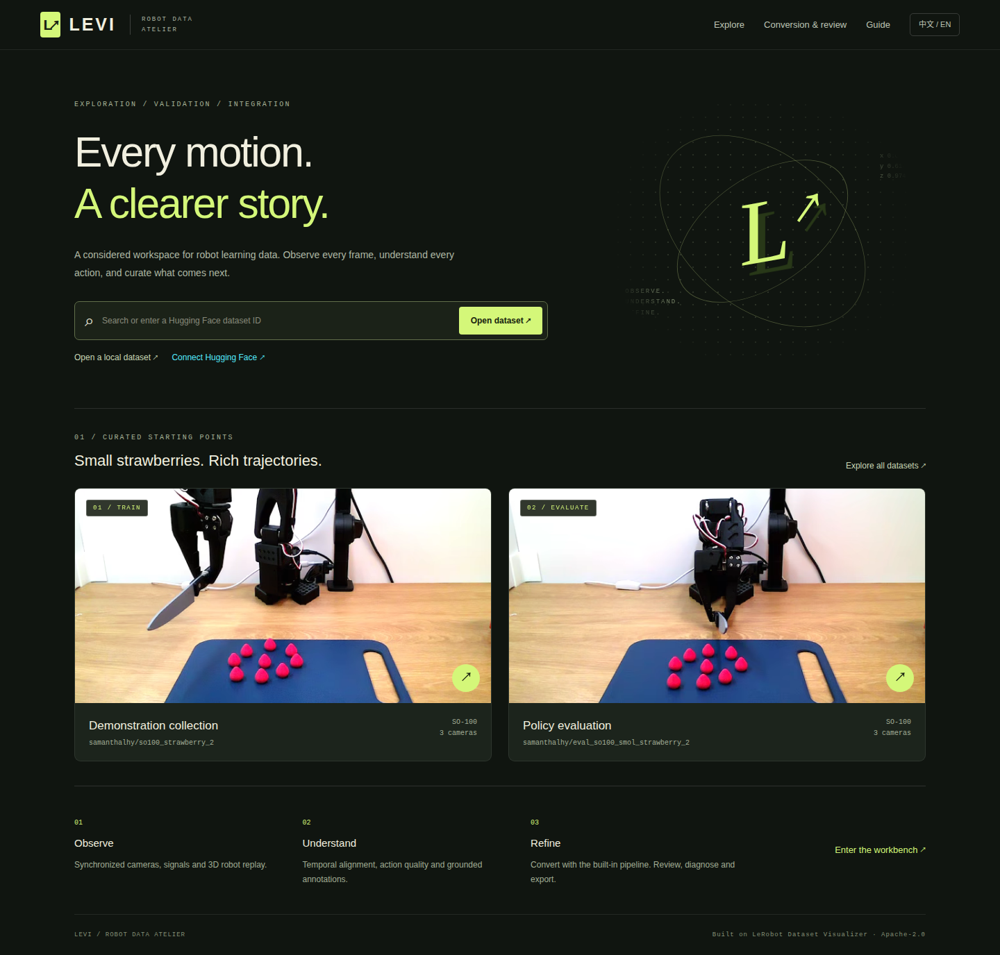
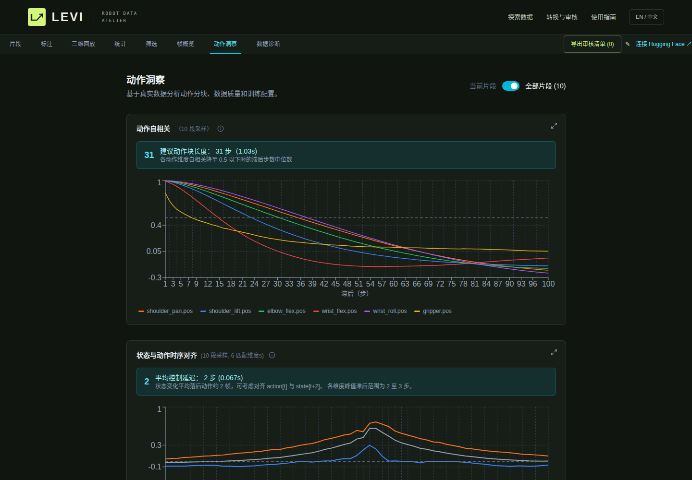

# Validation record / 验证记录

验证日期：2026-09-13。环境：Linux x86_64、Python 3.11.16（独立 uv `.venv`）、Bun 1.3.10、Next.js 15.5.25、Playwright Chromium。参考版本见 [UPSTREAM.md](UPSTREAM.md)。

## 2026-09-22 Local Ollama and supervised annotation increment / 本地模型与监督标注增量

This is incremental engineering validation, not acceptance of the full 0.4.0
architecture plan. See [implementation status](architecture/IMPLEMENTATION_STATUS.md).

| Check | Result |
| --- | --- |
| Full Python suite, including fake Ollama and teacher feedback | 248 passed, 1 opt-in browser test skipped; one Starlette/AnyIO deprecation warning |
| Final process-persistence failure fix and contract regression | 17 passed, including a newly added disk-failure test |
| Ruff | Passed |
| Contract snapshot drift check | Passed |
| Frontend type, lint, formatting and unit checks | Passed; 200 Bun tests |
| Production Next.js build | Passed |
| Opt-in production-browser test with fixture API | 1 passed; English/Chinese connection and download/cancel controls; no page errors |

The final process cleanup change was verified with the targeted suite after the
full Python run. Model HTTP responses, teacher decisions and process ownership
are simulated. Browser validation starts only a temporary frontend, blocks
external requests, uses Chromium with GPU disabled and stops its owned server.
No real model request, Ollama launch, CUDA probe, model download or GPU inference
was performed. Model quality, external-client teaching quality, hardware resource
competition and OS-enforced offline operation remain unverified.

Reproduce the model-free checks from the repository root (create the temporary
parent first):

```bash
mkdir -p .state/tmp/validation
LEVI_WORKSPACE="$PWD/.state" uv run pytest --basetemp "$PWD/.state/tmp/validation/pytest"
uv run levi dev check-contracts
bun run format
bun run validate
bun run build
# Optional: point to an already installed Chromium; no browser download required.
LEVI_WORKSPACE="$PWD/.state" LEVI_BROWSER_TESTS=1 \
  LEVI_CHROMIUM_EXECUTABLE=/path/to/chromium \
  uv run pytest tests/test_ollama_browser.py \
  --basetemp "$PWD/.state/tmp/validation/browser"
```

## 2026-09-18 转换框架、RECAP 与原始采集 / Conversion framework, RECAP, raw captures

Scope: modular conversion registry, single-pass pipeline and lossless retime, RECAP value export, input inspection UI, raw-capture browsing views, annotation carry-over, outcome labels, hash-free naming and workspace migration.

| Check | Result |
| --- | --- |
| Python / FastAPI tests | **102 passed** (contract tests over every input/output pair, stage-chain equivalence, RLinf `compute_returns.py` conformance, views, carry-over, migration, naming, concurrency) |
| Bun unit tests | **179 passed**, 0 failed |
| `uv run levi check` (type-check, lint, format, ruff) | Passed |
| Production build | Passed |
| Test isolation | Real workspace listing identical before/after the Python suite |
| Real capture inspection (`pick_screws…`, 171 demos) | 2.1 s; all requirements pass; 47 success / 124 failure; LeRobot supported, RECAP supported with warnings (single task, no interventions) |
| Real video retime | 0.11 s per 200-frame video; decoded pixels identical; packet interval exactly 0.1 s |
| Real browsing view | 171 demos / 342 videos remuxed in 38 s, none excluded; viewer, statistics, frame gallery, annotations and Doctor rendered in Chromium with 0 page errors |
| Browser end-to-end (isolated port and workspace, 3 real demos) | Inspect → RECAP export (6 videos remuxed) with live progress; raw view registered; outcome labelled from the sidebar; conversion carried 1 atom and 1 label over; Chinese UI checklist |
| Workspace migration | Dry run, apply, second run a no-op on the real workspace |

Runtime sync (2026-09-19): **110 Python tests** including discovery with settle timing, in-place episode changes (catalog, backend cache, live revision), removal and annotation re-attachment, raw-capture rebuild on added/removed demos with label re-keying, failed-view retry only after change, skipped LEVI folders, and a three-process catalog write test (120/120 entries). Browser check on an isolated workspace: a demo added while the viewer was open produced the reload notice after 7.4 s and the reloaded sidebar showed the new episode; deleting the capture showed the removed notice and emptied the list; 0 page errors.

Not exercised: a timed full conversion of the 171 real demos against the previous 32-minute baseline (a live robot training session shared the machine), and training a value model in RLinf on the export.

## 0.3.0 独立发行检查 / Standalone release check

This release focused on dataset-version recognition, task counting/filtering, metadata validation, and cache isolation across LeRobot v2.0/v2.1/v3.0/v3.1 layouts. No source dataset or generated workspace output was modified by the validation.

### 自动检查 / Automated checks

| Check | Result |
| --- | --- |
| Frontend type checks | Passed |
| ESLint | 0 errors; 0 warnings |
| Prettier | Passed |
| Bun unit tests | **176 passed, 0 failed** across 10 files; 1,812 expect calls |
| Python / FastAPI tests | **55 passed**; 2 dependency deprecation warnings |
| `uv run levi check` | Passed |
| `uv lock --check` | Passed |
| Production Next.js build | Passed |
| `git diff --check` | Passed |

The new tests cover canonical version aliases/rejection, string and shuffled task indices, multi-task metadata, v2/v3 task-index mappings, invalid FPS, exact episode-length statistics, finite chart values, language instruction extraction, scoped Action Insights behavior, bilingual catalog parity, storage-safe browser fallbacks, and platform shortcut handling.

## 0.2.0 独立发行检查 / Standalone release check

A source-only copy was installed under a renamed checkout with a separate workspace containing a space in its path. Its own uv environment passed all **46 Python tests**, and a fresh frontend dependency install and production build succeeded. With `LEVI_WORKSPACE` unset, the default was that checkout's `.state`; an unrelated environment variable did not change it. No sibling conversion repository was present.

The production web workbench was also exercised: advanced JSON selected quaternion orientation and state-as-action, the immutable plan ran the complete built-in pipeline, the result was automatically registered, and both 640×480 videos reached readyState 4. Browser page errors: **0**. A second integration run used the default Euler/next-state configuration successfully.

The publication scan excludes local `.env`, environments and generated artifacts. Public source/docs contain no machine-specific workspace names or absolute personal paths. Cleanup targets are explicit; registered datasets, durable outputs and shared runtimes/caches are preserved.

Cache cleanup was applied after validation: generated Next.js output, test/ruff caches, uv marker caches and source `__pycache__` directories were removed. Environments, installed runtimes, datasets, annotations and durable outputs were preserved.

## 自动检查 / Automated checks

| Check | Result |
| --- | --- |
| Frontend type checks, app and tests | Passed |
| ESLint | 0 errors; 3 retained upstream React Hook dependency warnings |
| Prettier | Passed |
| Bun unit tests | **165 passed, 0 failed** |
| Python / FastAPI tests | **46 passed**; 2 dependency deprecation warnings |
| Production Next.js build | Passed |
| Ruff fatal Python checks | Passed |
| `git diff --check` | Passed |

Python tests additionally cover the complete bundled pipeline, image/FPS resampling, source byte preservation, quaternion geometry, measured image statistics, metadata repairs, task maps, immutable job plans, changed-source rejection and cache cleanup boundaries.

SAM3 CPU-only coverage includes RLE losslessness, Sidecar revisions and human edits, API plan/run/export source safety, response path redaction, v3 shared-video metadata resolution, invalid refinement rejection, global status checks, authenticated workspace checkpoint download/progress and the real-run checkpoint gate, and the explicitly disabled worker CLI. No test imported Torch, probed CUDA or ran a SAM3 model.

Python tests cover dataset registration, byte-range video reads, path/symlink boundaries, cross-origin writes, dataset-scoped review persistence, v2 annotation export without source modification, exact frame snapping, v3.1 episode metadata, diagnostics and rejected invalid jobs. Frontend tests include v2 JSONL episode-length statistics and invalid FPS handling, alongside the retained upstream math/parsing suite.

## 真实运行 / Live checks

| Scenario | Observed result |
| --- | --- |
| English landing and live Chinese switch (standalone browser) | Both rendered; English choice survived reload |
| Mobile, 390 × 844 | No horizontal page overflow |
| Frontend 7860 → backend 7871 | Runtime proxy worked with a different backend port after build |
| Default evaluation collection | 10 episodes, 32,033 frames, 30 FPS; three 640 × 480 videos ready |
| Statistics | v2 episode-length distribution and shortest/longest summaries rendered |
| Filtering / frame gallery | Movement and smoothness views; first/last camera grid rendered |
| Action insights, all 10 episodes | Suggested chunk **31 steps / 1.03 s**; mean state/action lag **2 steps / 0.067 s** |
| SO-100 URDF | Actual model loaded and displayed in Chromium |
| Language annotation | Saved to the local backend sidecar |
| Grounded VQA | Dragged box, supplied object label, persisted camera and coordinates |
| Dataset export | New dataset with persistent/event language rows; source unchanged |
| Bundled conversion worker | Full generated CSV/H.264 pipeline and API job succeeded; output automatically registered |
| Converted dataset | Two 640 × 480 videos loaded; native video diagnosis had no failures |
| v3.1 synthetic shared-file dataset | Episode 1 video began around 1.5 s; metadata across two chunks; statistics and annotations loaded |
| Standalone Chromium / external-browser interaction | `window.parent === window`; Ctrl/Cmd+S/Z/Y were canceled before native browser defaults; the annotation popup opened centered and dragged successfully |
| Browser page errors | **0** in the final standalone smoke check |

The reference dataset's native diagnostic run inspected all 10 episodes: **8 pass / 15 warn / 0 fail / 3 skip**. Skipped results were video decode checks. These are individual result counts and intentionally do not replicate the external Doctor's counts. See [FEATURES.md](FEATURES.md) for exact check scope.

## 重现 / Reproduce

Start `uv run levi serve` in another terminal. Install the development group and Chromium as described in the README, then:

```bash
uv run python scripts/verify_browser.py
# Optionally also verify a registered local dataset:
uv run python scripts/verify_browser.py --local-repo local/YOUR_REGISTERED_ID
# Built-in conversion integration (generates its own fixture):
uv run python scripts/verify_conversion.py
```

The browser script reads public datasets and writes screenshots/results to `outputs/LEVI/validation/` inside the resolved workspace. The conversion script creates synthetic inputs and new conversion outputs. Logs, actual paths, review sidecars and converted data are not bundled into Git.

## 未执行项 / Not exercised

- Private-account login, OAuth authorization and Hub upload were not exercised with live credentials; no dataset was published. Public access and local auth UI were checked.
- The Dockerfile is provided, but a Docker build/run was not verified because this session had no permission to access the local Docker daemon.
- Linux x86_64 was tested. macOS, ARM64, WSL2 and multi-user deployment were not tested.
- The checks above do not establish behavior on every dataset, camera codec or training loader. Image-only datasets retain the upstream limitation.
- The SAM3 worker, model checkpoint, CUDA runtime and real GPU inference were intentionally not exercised; only its model-free CPU configuration/status checks and adapter metadata tests ran. Deployment instructions for a CUDA host are documented separately and do not claim local GPU validation.

## 界面 / Screenshots






Screenshot video content: [samanthalhy/so100_strawberry_2](https://huggingface.co/datasets/samanthalhy/so100_strawberry_2) and [samanthalhy/eval_so100_smol_strawberry_2](https://huggingface.co/datasets/samanthalhy/eval_so100_smol_strawberry_2), whose dataset cards declared Apache-2.0 on the validation date. Both were removed from the Hub before 2026-09-20 and are no longer LEVI's default demonstrations; the screenshots are kept as the record of that validation run. LEVI interface design and modifications are described in [UPSTREAM.md](UPSTREAM.md).


## Agent Workbench — 2026-09-20 local validation

This section concerns the experimental Agent implementation described in
[AGENT_WORKBENCH.md](AGENT_WORKBENCH.md), not a published release.

- Python regression: **136 passed** with the optional Agent SDKs installed.
  Includes content-pinned input, atomic publication failure, stale edits,
  idempotency, inverse ChangeSets, scoped access, credential binding, staged
  object review and official MCP SDK in-memory roundtrips. A dependency
  `anyio.abc.BlockingPortal` deprecation warning remains; no worker-thread
  exception was reported.
- Frontend: **179 Bun tests passed**, type checks, ESLint, formatting and
  the production Next.js build passed. Ruff and the offline uv lock check passed.
- Offline Chromium UI smoke passed: unsaved draft preservation, batch review,
  approval/commit, session credential save/disconnect, no key in localStorage,
  bilingual switching, readable select options and mobile layout. External
  requests were blocked and application APIs mocked; Chromium used `--disable-gpu`.
  Artifacts are `outputs/LEVI/validation/agent/` relative to `LEVI_WORKSPACE`.
- Workspace memory refresh/check and directory doctor passed. The heuristic
  path checker reported dictionary-key and explicitly rooted-path matches;
  these are not evidence of writes outside `LEVI_WORKSPACE`.

No real model inference, GPU execution, CUDA detection, checkpoint download,
external account login or publication was performed. SAM3 is exercised through
a protocol substitute; the compatible provider uses a mock HTTP transport.
At this earlier increment, ACP and HTTP MCP remained deferred. Engineering tests do not establish annotation
quality or satisfaction of the separate real-model acceptance gates.

## Harness increment — 2026-09-20

See [HARNESS.md](HARNESS.md) for the source audit, research references,
contracts and intentionally unsupported automation.

- Full CPU/fixture Python suite: **148 passed**. Additional cases cover plan
  approval bypass, exact revision/digest binding, rejected/changed pilot,
  budget revision, content-keyed model reuse, bounded recall, strict observation
  cap, nonuniform PTS mapping, temporal attempts/outcomes, staged mask preview,
  and native annotated export roundtrip. Source file hashes remain unchanged.
- After the final adapter and runtime refinements, the targeted Agent/SDK
  regression suite passed **39 tests**; these overlap with the full-suite count.
- Frontend validation: **179 Bun tests passed**, TypeScript, ESLint, formatting
  and production build passed. Offline Chromium additionally exercises the
  execution-approval and pilot-acceptance buttons, draft editing, batch review,
  commit, account switching state, bilingual rendering and mobile layout.
- Cache regression verifies that an identical repeated fixture phase produces
  the same structured output without increasing model request/token counters.
  This is a deterministic cache contract, not a measured real-model saving.
- `agent/evaluation.py` rejects efficiency comparisons with different input,
  policy, observation, validation or output digests. Real token efficiency,
  elapsed provider time, mask/temporal accuracy and human correction time remain
  **not measured**. No synthetic score is presented as real annotation quality.

The full browser smoke uses mocked APIs; staged video overlays are covered by
backend frame/sidecar checks and frontend compilation, not a real SAM3 visual
quality test. One existing Starlette/AnyIO deprecation warning remains.
No GPU, CUDA probe, real inference, checkpoint download or GitHub publication
was performed. Owned smoke-test servers exit after verification.

The final workspace doctor reported zero errors and 11 warnings about inherited
shell environment paths outside the managed workspace; no global environment
or user configuration was changed. The static path scan reported eight
`output` dictionary-key matches in Agent modules; those are data fields, not
relative filesystem destinations. Generated memory refresh/check passed.

## Dual-channel Pilot increment — 2026-09-20

See [PILOT.md](PILOT.md) and [PILOT.zh-CN.md](PILOT.zh-CN.md) for sequential
installation, connection, terminal approval and recovery instructions.

- Full Python regression: **160 passed**, with one existing Starlette/AnyIO
  deprecation warning. Ruff passed. New cases exercise scoped/revoked grants,
  non-API external plans, project configuration preservation, action receipts,
  private singleton Core Host reuse/stop, runtime binding, and simulated ACP
  notifications, permissions and managed-session lifecycle.
- Final frontend validation: **179 Bun tests passed**, TypeScript, ESLint,
  formatting and production build passed. One existing React Hook dependency
  warning remains in `video-overlay-canvas.tsx`. Offline Chromium smoke passed
  with fixture APIs and the owned local frontend, including manifest display,
  runtime account guidance and the existing approval/review workflow. Evidence
  navigation compiles; real video/model navigation remains a manual gate.
  An earlier browser command omitted `--start` and failed to connect; rerunning
  with the owned test server passed. Browser artifacts are
  `outputs/LEVI/validation/agent/` relative to `LEVI_WORKSPACE`.
- Workspace memory refresh/check passed. Directory doctor: zero errors and
  11 inherited environment-path warnings. The static scan's 12 matches are
  JSON/dictionary fields and CLI command strings, not output destinations.
- Optional adapter versions are locked; real Codex/Claude CLI, VS Code, account
  switching, model/media compatibility and annotation quality remain **unverified**.
  Managed adapters require Node.js 22+; missing Node blocks execution explicitly.
  HTTP MCP remains unavailable; stdio is the supported MCP transport.
- No GPU execution, CUDA probing, model inference, checkpoint downloads, Git
  commits, pushes or releases were performed.
